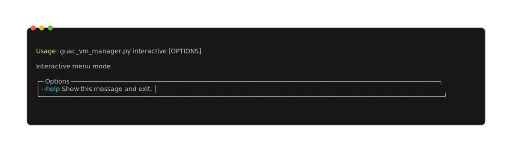
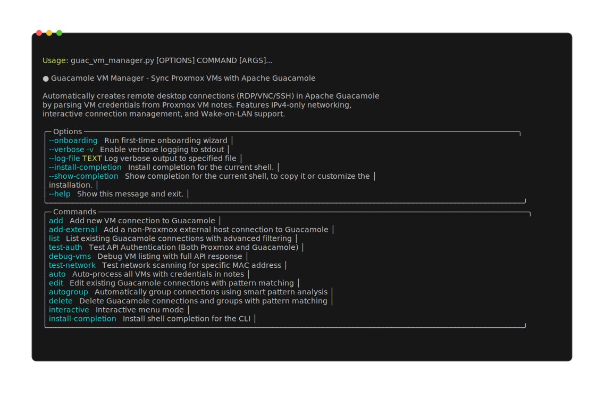
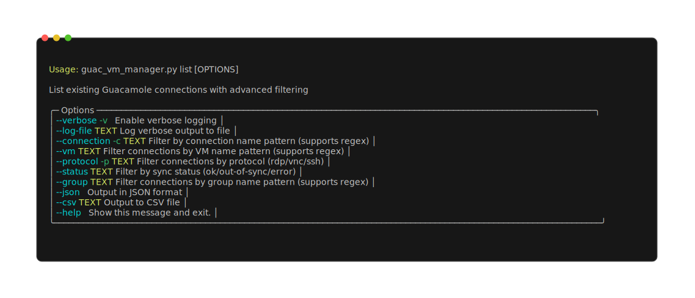
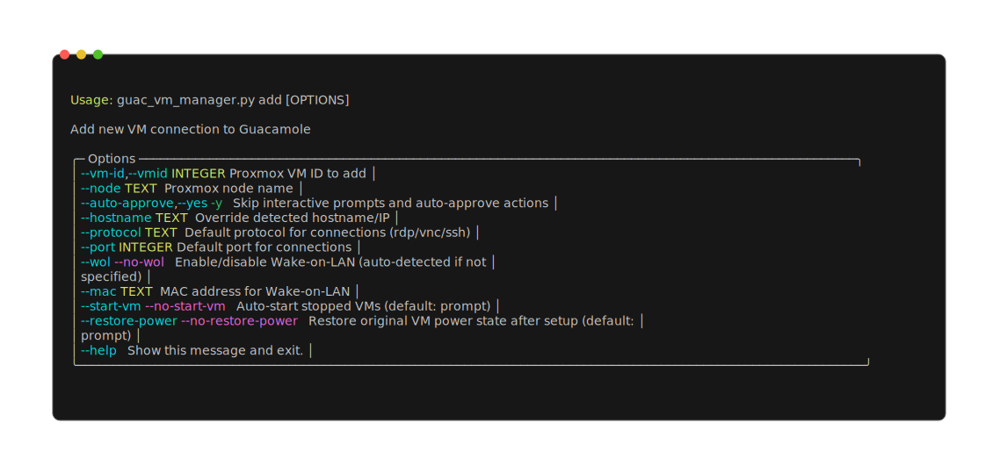
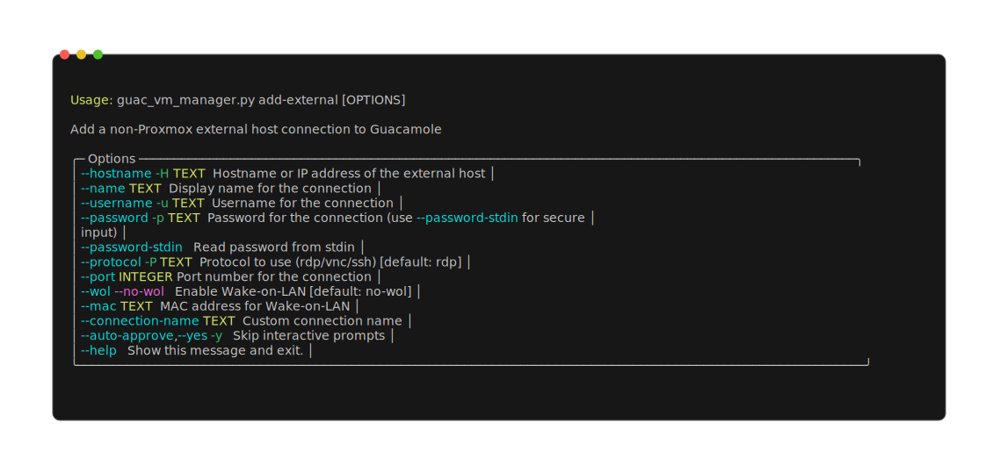
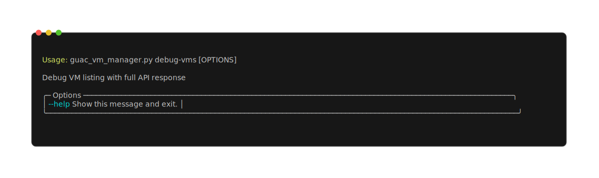
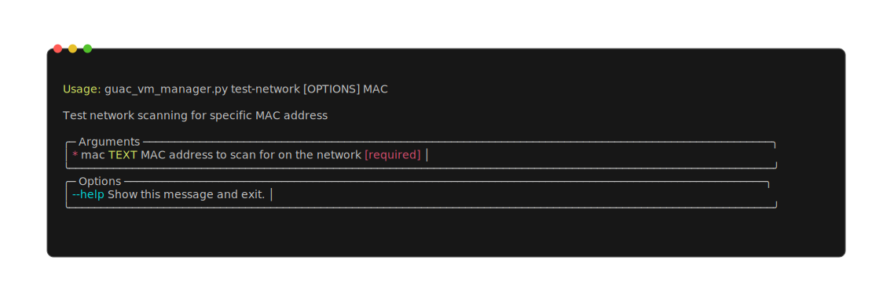

# Proxmox-Guacamole Sync

<div align="center">
  
</div>

Single-file utility that reads structured credentials from Proxmox VM notes and (re)creates matching RDP / VNC / SSH connections in Apache Guacamole. Includes IP discovery, grouping, optional password encryption, Wake‑on‑LAN and powerful bulk operations.

---
## 1. Quick Start (Minimal Path)
```bash
git clone https://github.com/SpotlightForBugs/Proxmox-Guacamole-Sync.git
cd Proxmox-Guacamole-Sync
cp config_example.py config.py   # Edit credentials
uv sync                          # Or: uv pip install -r requirements.txt
uv run python guac_vm_manager.py test-auth
uv run python guac_vm_manager.py auto
```
Add to a VM's Notes in Proxmox (example):
```
user:"admin" pass:"MyPassword" protos:"rdp,ssh";
```
Run `auto` again – connections appear in Guacamole.

---
## 2. Why This Tool
* Zero-daemon, single script (`guac_vm_manager.py`)
* No DB migrations or schema coupling – talks directly to both APIs
* Works even when guest agent IP is missing (ARP + ping fallback)
* Safe idempotent sync – updates instead of duplicating
* Optional transparent password encryption (Fernet) in VM notes
* Built for bulk ops (regex filters, partial arguments, auto-discovery)

---
## 3. Supported Protocols & Defaults
| Protocol | Default Port | Adjustable Via Note Key |
|----------|--------------|-------------------------|
| RDP      | 3389         | `rdp_port:"3390"`       |
| VNC      | 5900         | `vnc_port:"5901"`       |
| SSH      | 22           | `ssh_port:"2222"`       |

VNC extra settings via `vnc_settings:"key=value,..."` (e.g. `color-depth=32,encoding=tight,read-only=false`).

---
## 4. VM Notes Syntax Cheat Sheet
Each credential block ends with a semicolon `;`. Keys are order‑independent.
```
user:"admin" pass:"pw" protos:"rdp,vnc" confName:"{vmname}-{user}-{proto}";
user:"viewer" pass:"readonly" protos:"vnc" vnc_settings:"read-only=true,color-depth=16";
user:"ops" encrypted_password:"<FERNET_BLOB>" protos:"ssh";
```
Supported keys (aliases in parentheses):
* `user` (`username`)
* `pass` / `password` / `encrypted_password`
* `protos` (`proto`, `protocols`) – comma separated
* `confName` (`connection_name`) – templated name
* Protocol ports: `rdp_port`, `vnc_port`, `ssh_port`
* Protocol settings: `vnc_settings`
* `wol_disabled:"true"` to suppress Wake-on-LAN for that credential

Template variables inside `confName`:
`{vmname}`, `{user}`, `{proto}`, `{port}`, `{vmid}`, `{node}`, `{ip}`, `{hostname}`

---
## 5. Password Encryption (Optional but Recommended)
Generate key:
```bash
python -c "from cryptography.fernet import Fernet; print(Fernet.generate_key().decode())"
```
Set `ENCRYPTION_KEY` in `config.py`.
If a note line uses `pass:"cleartext"` it is auto‑converted in-place (non‑destructive) to `encrypted_password:"..."` on first processing.

---
## 6. Configuration (`config.py`)
Minimal required fields:
```python
class Config:
    GUAC_BASE_URL = "https://guacamole.example.com"
    GUAC_USERNAME = "admin"
    GUAC_PASSWORD = "admin_password"
    GUAC_DATA_SOURCE = "mysql"     # or postgresql/sqlserver

    PROXMOX_HOST = "192.168.1.100"
    PROXMOX_TOKEN_ID = "root@pam!mytoken"
    PROXMOX_SECRET = "<token_secret>"

    ENCRYPTION_KEY = "<optional_fernet_key>"
```
First run discovers/locks working Guacamole API base path & data source variants automatically.

---
## 7. Essential Commands
```bash
uv run python guac_vm_manager.py test-auth      # Validate both APIs & encryption key
uv run python guac_vm_manager.py auto           # Process all VMs with credential notes
uv run python guac_vm_manager.py add            # Interactive VM picker
uv run python guac_vm_manager.py add-external   # Non-Proxmox host
uv run python guac_vm_manager.py list           # List + status flags
uv run python guac_vm_manager.py edit           # Bulk edit by pattern
uv run python guac_vm_manager.py delete         # Interactive / pattern delete
uv run python guac_vm_manager.py autogroup      # Group connections intelligently
uv run python guac_vm_manager.py test-network <MAC>
```
No subcommand = interactive menu.

Quick visual reference:



---
## 8. Pattern Matching & Bulk Operations
Applies to: `list`, `edit`, `delete`.
* Regex allowed: `--connection ".*-admin-.*"`
* Multiple comma-separated expressions: `--connection "web-.*,db-.*"`
* Wildcards (`*`) auto-translated to regex `.*`
* Missing required CLI options trigger prompts (partial option mode)

Examples:
```bash
uv run python guac_vm_manager.py list --protocol rdp --connection "*-admin-*"
uv run python guac_vm_manager.py edit --connection "vm-.*-rdp" --username newuser --password newpass
uv run python guac_vm_manager.py delete --connection "temp-.*" --force
```

---
## 9. Wake‑on‑LAN
Enabled by default per connection unless `wol_disabled:"true"` in that credential line.
If target MAC + broadcast path resolvable, WoL packet is sent before connection creation when the VM was off (then original state restored afterwards).

---
## 10. IP / Network Discovery Flow
Order of attempts:
1. Proxmox guest agent reported IPv4
2. Cached previous IP (if still alive)
3. ARP table parse (platform aware: Windows `arp -a`, Unix `arp -an` fallback to `arp -a`)
4. Optional subnet scan + ping sweep (boot VM temporarily if powered off and allowed)

All IPv6 addresses are ignored deliberately (Guacamole connection stability & simplicity).

---
## 11. VNC Settings Reference
`vnc_settings:"key=value,..."`
| Key            | Values                                      | Notes |
|----------------|----------------------------------------------|-------|
| color-depth    | 8,16,24,32                                   | Quality vs bandwidth |
| encoding       | raw,rre,corre,hextile,zlib,tight,ultra       | tight = good balance |
| cursor         | local,remote                                 | |
| read-only      | true,false                                   | Viewer mode |
| disable-copy   | true,false                                   | Clipboard restrict |
| disable-paste  | true,false                                   | |
| enable-sftp    | true,false                                   | If supported |
| swap-red-blue  | true,false                                   | Color channel fix |
| autoretry      | integer                                      | Retry attempts |

---
## 12. Connection Naming Templates
Default if none supplied: `<vmname>-<user>-<proto>`.
Custom: `confName:"{vmname}-{user}-{proto}-{vmid}"`.
Variables are resolved after IP discovery so `{ip}` becomes the final resolved address.

---
## 13. Status Reporting (List Command)
Each connection line may include flags:
* OK – In sync
* PORT – Port mismatch vs note definition
* CREDS – Username or password changed
* PROTO – Protocol set differs
* MISSING – Exists in notes but missing in Guacamole (will be created on auto)

Use `--json` or `--csv <file>` for export.
Example list output with status flags:


---
## 14. Interactive Mode (Cross‑Platform)
* Unix: arrow / tab navigation (termios)
* Windows: `msvcrt` single-key navigation with TAB + arrows
* Always accepts direct numeric entry or `q` to quit
Screens:


---
## 15. Security Model
| Aspect              | Approach |
|---------------------|----------|
| Credential storage  | Proxmox VM notes only |
| At-rest password    | Optional Fernet encryption inline |
| Transit             | HTTPS (cert validation disabled by default for self‑signed) |
| Key validation      | Encryption key sanity-checked at startup |
| Token scope         | Proxmox token requires VM read (+ optional start/stop for discovery) |

Disable certificate warnings only if you control both endpoints.

---
## 16. Troubleshooting
| Problem | Check |
|---------|-------|
| Auth fails | URLs, token scope, Guac user/pass |
| No IP | Guest agent stopped? Network segment mismatch? ARP permission? |
| Wrong password | Re-run `auto` after updating note; ensure encryption key unchanged |
| Duplicates | Ensure unique `confName` template and no manual conflicting creations |
| Slow scan | Large /24 subnet + ping sweep; restrict with patterns or supply known IP |

Useful commands:
```bash
uv run python guac_vm_manager.py test-auth
uv run python guac_vm_manager.py debug-vms
uv run python guac_vm_manager.py test-network "AA:BB:CC:DD:EE:FF"
```

---
## 17. Architecture (Internal Overview)
Component summary (all in one file):
| Component       | Responsibility |
|-----------------|---------------|
| GuacamoleAPI    | Auth, endpoint probing, CRUD for connections/groups |
| ProxmoxAPI      | VM enumeration, note retrieval, power state handling |
| Credential Parser | Regex + tokenization of flexible note syntax |
| NetworkScanner  | ARP parsing, ping probing, MAC→IP resolution |
| WakeOnLan       | UDP broadcast magic packet generation |
| Grouping Engine | Pattern heuristics to form logical groups |
| CLI Layer       | Typer commands + interactive menu rendering |

Design principles:
* Stateless between runs (except cached working Guac path)
* Fail-soft: degrade rather than abort on partial errors
* No external daemons; all transient operations

---
## 18. Development
```bash
uv sync
uv run python guac_vm_manager.py --debug-vms
uv run python guac_vm_manager.py test-network "<mac>"
pytest   # If you add tests
```
Coding guidelines:
* Keep single-file structure
* Avoid adding heavyweight deps
* Preserve credential parsing semantics
* Do not commit real credentials; `config.py` is git-ignored

---
## 19. Extending
Where to hook:
* Add new protocol: extend parser (port + settings), adjust GuacamoleAPI create/update mapping
* Add export format: extend list command output branch
* Enhance grouping: modify heuristic scorer in grouping section

---
## 20. Guacamole Deployment (Reference)
Minimal compose (host networking for WoL broadcast):
```yaml
version: "3"
services:
  guacamole:
    image: abesnier/guacamole
    network_mode: host
    restart: unless-stopped
    volumes:
      - guacdata:/config
volumes:
  guacdata: {}
```
Use Cloudflare Tunnel or reverse proxy for external exposure if needed.

---
## 21. Output Examples
Help (global):


Per-command help:




Authentication test:


VM discovery / selection:


Connection list view:


Auto process (normal):


Auto process (force recreate):


Add external host workflow:


Interactive main menu:


Interactive delete selector:


Network / MAC scan:


---
## 22. License
MIT – see `LICENSE`.

---
## 23. At a Glance (Copy/Paste Reference)
```
Notes line: user:"admin" pass:"pw" protos:"rdp,ssh";
Encrypt key: python -c "from cryptography.fernet import Fernet;print(Fernet.generate_key().decode())"
Sync all:    uv run python guac_vm_manager.py auto
Test auth:   uv run python guac_vm_manager.py test-auth
Find MAC:    uv run python guac_vm_manager.py test-network "AA:BB:CC:DD:EE:FF"
List RDP:    uv run python guac_vm_manager.py list --protocol rdp
Bulk edit:   uv run python guac_vm_manager.py edit --connection "web-.*" --username ops
Delete temp: uv run python guac_vm_manager.py delete --connection "temp-.*" --force
```

End of README.
