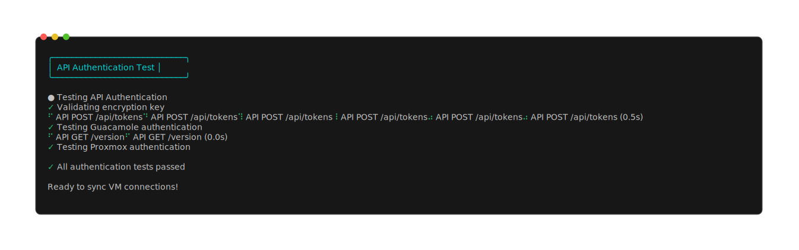
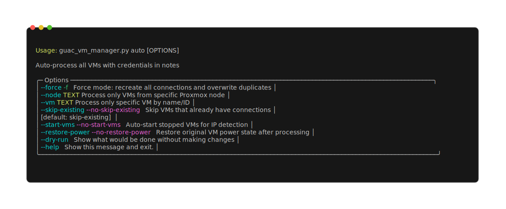

# Proxmox-Guacamole Sync

Automated synchronization tool that bridges Proxmox VE and Apache Guacamole by parsing VM connection credentials from Proxmox VM notes and creating corresponding remote desktop/SSH connections in Guacamole.

## Architecture

- **Single-file Python application** (`guac_vm_manager.py`) - 2800+ lines, no framework dependencies
- **REST API integration** - Direct HTTP calls to both Proxmox and Guacamole APIs
- **Credential parsing engine** - Flexible syntax parser for VM notes field
- **Network discovery** - ARP/ping scanning when Proxmox guest agent unavailable
- **Built-in Wake-on-LAN** - No external WoL dependencies

## Core Features

### VM Credential Management
- Parse connection credentials from Proxmox VM notes using flexible key-value syntax
- Support for RDP, VNC, and SSH protocols with protocol-specific settings
- Automatic password encryption/decryption using Fernet symmetric encryption
- Template variable substitution: `{vmname}`, `{user}`, `{proto}`, `{port}`, `{vmid}`, `{node}`, `{ip}`, `{hostname}`

### Network Intelligence
- **IPv4-only networking** - Filters IPv6 addresses for clean connections
- Guest agent IP detection with ARP table + ping sweep fallback
- Automatic VM startup for IP discovery with state restoration
- Local network scanning assumes tool runs on same subnet as VMs

### Synchronization Logic  
- Bidirectional sync detection (Proxmox ↔ Guacamole)
- Out-of-sync remediation: update existing, recreate, or pull from Guacamole
- Duplicate connection detection and cleanup
- Connection grouping per VM when multiple users/protocols exist

## VM Notes Syntax

Credentials are stored in Proxmox VM notes using structured key-value format:

```
user:"admin" pass:"P@ssw0rd" protos:"rdp,vnc" rdp_port:"3390" confName:"{vmname}-{user}-{proto}";
user:"readonly" pass:"view123" protos:"vnc" vnc_settings:"read-only=true,color-depth=16";
```

### Supported Parameters
- `user`/`username` - Connection username
- `pass`/`password`/`encrypted_password` - Plain or encrypted password  
- `protos`/`protocols`/`proto` - Comma-separated protocol list
- `confName`/`connection_name` - Template for connection naming
- `{proto}_port` - Protocol-specific port (rdp_port, vnc_port, ssh_port)
- `{proto}_settings` - Protocol configuration (comma-separated key=value pairs)
- `wol_disabled` - Disable Wake-on-LAN for this connection

### VNC-Specific Settings
```
vnc_settings:"color-depth=32,encoding=tight,read-only=false,cursor=local"
```
- `color-depth`: 8, 16, 24, 32 (bit depth)
- `encoding`: raw, rre, corre, hextile, zlib, tight, ultra
- `cursor`: local, remote
- `read-only`: true/false (view-only mode)

<details>
<summary><strong>🔐 Password Encryption (Optional Security Feature)</strong></summary>

The tool provides automatic password encryption for enhanced security. When you configure an encryption key, the tool will automatically detect plain passwords in VM notes and offer to encrypt them.

### How It Works

1. **Automatic Detection**: Tool scans VM notes for plain `pass:"password"` entries
2. **Encryption Offer**: Prompts to encrypt plain passwords during processing
3. **Seamless Migration**: Converts `pass:"plaintext"` to `encrypted_password:"gAAAAAB..."`
4. **Non-Destructive**: Preserves all other content in VM notes

### Setup Encryption

**Generate encryption key:**
```bash
python3 -c "from cryptography.fernet import Fernet; print(Fernet.generate_key().decode())"
# Output: b8kR9X2mF1nQ7vP4sE6tA5wK3hL9mN0pQ2rT8uY7iO1kL4sE6=
```

**Add to config.py:**
```python
class Config:
    # ... other settings ...
    ENCRYPTION_KEY = "b8kR9X2mF1nQ7vP4sE6tA5wK3hL9mN0pQ2rT8uY7iO1kL4sE6="
```

### Example Migration

**Before (plain password):**
```
user:"admin" pass:"MyPassword123" protos:"rdp,ssh";
```

**After automatic migration:**
```
user:"admin" encrypted_password:"gAAAAABhZ8X2mF1nQ7vP4sE6tA5wK3hL9mN0pQ2rT8uY7iO1kL4sE6..." protos:"rdp,ssh";
```

### Benefits

- **Security**: Passwords encrypted at rest in VM notes
- **Transparency**: Tool automatically encrypts/decrypts as needed  
- **Backward Compatibility**: Mixed plain/encrypted passwords supported
- **Key Validation**: Encryption key tested on startup to prevent issues

</details>

## Example Outputs

### Authentication Test
```bash
$ uv run python guac_vm_manager.py test-auth
```



### VM Discovery and Connection Creation
```bash
$ uv run python guac_vm_manager.py add
```


### Connection Listing with Sync Status
```bash
$ uv run python guac_vm_manager.py list
```


### Auto-Processing All VMs
```bash
$ uv run python guac_vm_manager.py auto
```



### Network Discovery Example
```bash
$ uv run python guac_vm_manager.py test-network "52:54:00:12:34:56"
```
```
● Testing network discovery for MAC: 52:54:00:12:34:56

Scanning ARP table... 
├─ Found 23 entries
├─ No direct match for target MAC

Performing ping sweep on 192.168.1.0/24...
├─ Scanning 254 addresses
├─ Found 12 responsive hosts
├─ Cross-referencing with ARP table...
└─ No correlation found

Performing ping sweep on 10.0.1.0/24...  
├─ Scanning 254 addresses
├─ Found 8 responsive hosts
├─ Cross-referencing with ARP table...
└─ ✓ Found match: 10.0.1.45

┌─ Discovery Result ─┐
│ MAC: 52:54:00:12:34:56  │
│ IP:  10.0.1.45          │
└─────────────────────────┘
```

## Installation

### Requirements
- Python 3.8+
- Network access to both Proxmox and Guacamole servers
- Proxmox API token with VM read permissions  
- Guacamole admin account with connection management rights

### Setup
```bash
# Clone repository
git clone https://github.com/SpotlightForBugs/Proxmox-Guacamole-Sync.git
cd Proxmox-Guacamole-Sync

# Install dependencies (UV recommended)
uv pip install -r requirements.txt

# Configure credentials
cp config_example.py config.py
# Edit config.py with your API endpoints and credentials

# Test configuration
uv run python guac_vm_manager.py test-auth
```

### Configuration
Edit `config.py` with your environment details:

```python
class Config:
    # Guacamole API
    GUAC_BASE_URL = "https://guacamole.example.com"
    GUAC_USERNAME = "admin"
    GUAC_PASSWORD = "admin_password"
    GUAC_DATA_SOURCE = "mysql"  # or postgresql
    
    # Proxmox API  
    PROXMOX_HOST = "192.168.1.100"
    PROXMOX_TOKEN_ID = "root@pam!token_name"
    PROXMOX_SECRET = "token_secret"
    
    # Password encryption (optional)
    ENCRYPTION_KEY = "your_fernet_key_here"
```

<details>
<summary><strong>🐳 Docker Deployment for Guacamole (Infrastructure Setup)</strong></summary>

If you need to deploy Guacamole itself, here are recommended Docker Compose configurations optimized for this tool:

### Basic Guacamole (Recommended)
```yaml
version: "3.8"

services:
  guacamole:
    image: abesnier/guacamole
    container_name: guacamole
    network_mode: "host"   # Essential: allows broadcast packets for Wake-on-LAN
    volumes:
      - postgres:/config
    restart: unless-stopped

volumes:
  postgres:
    driver: local
```

### With Cloudflare Tunnel (Advanced)
```yaml
version: "3.8"

services:
  guacamole:
    image: abesnier/guacamole
    container_name: guacamole
    network_mode: "host"   # Essential: allows broadcast packets for Wake-on-LAN
    volumes:
      - postgres:/config
    restart: unless-stopped

  cloudflared:
    image: cloudflare/cloudflared:latest
    container_name: cloudflared
    network_mode: "host"
    restart: unless-stopped
    command: tunnel --config /etc/cloudflared/config.yml run
    volumes:
      - ./cloudflared:/etc/cloudflared

volumes:
  postgres:
    driver: local
```

### Deployment Notes
- **`network_mode: "host"`** is **critical** for Wake-on-LAN functionality
- Use Proxmox LXC container for optimal performance and network access
- The `abesnier/guacamole` image includes PostgreSQL and is well-maintained
- Cloudflare tunnel provides secure external access without port forwarding

### Proxmox LXC Setup
```bash
# Create LXC container in Proxmox
pct create 200 ubuntu-22.04-standard_22.04-1_amd64.tar.zst \
  --storage local-lvm \
  --cores 2 \
  --memory 2048 \
  --net0 name=eth0,bridge=vmbr0,ip=dhcp \
  --hostname guacamole-lxc

# Install Docker in LXC
pct start 200
pct exec 200 -- bash -c "curl -fsSL https://get.docker.com | sh"
pct exec 200 -- systemctl enable --now docker

# Deploy Guacamole
pct exec 200 -- mkdir -p /opt/guacamole
# Copy docker-compose.yml to /opt/guacamole/
pct exec 200 -- bash -c "cd /opt/guacamole && docker compose up -d"
```

</details>

## Usage

### Command Line Interface
```bash
# Interactive VM selection and connection setup
uv run python guac_vm_manager.py add

# Auto-process all VMs with credential notes
uv run python guac_vm_manager.py auto

# Force recreate all connections (ignoring existing)
uv run python guac_vm_manager.py auto --force

# List existing connections with sync status
uv run python guac_vm_manager.py list

# Interactive connection deletion
uv run python guac_vm_manager.py delete

# Add external (non-Proxmox) host connections
uv run python guac_vm_manager.py add-external

# Test API authentication
uv run python guac_vm_manager.py test-auth

# Test network discovery for specific MAC
uv run python guac_vm_manager.py test-network "aa:bb:cc:dd:ee:ff"

# Full interactive menu (default if no command)
uv run python guac_vm_manager.py
```

### Workflow Examples

**Initial Setup:**
1. Add credentials to VM notes in Proxmox web interface
2. Run `uv run python guac_vm_manager.py add` to select VMs interactively
3. Tool discovers VM IPs, creates Guacamole connections, and sets up Wake-on-LAN

**Bulk Processing:**
```bash
uv run python guac_vm_manager.py auto
# Processes all VMs with structured credential notes
# Skips VMs without credentials or with existing up-to-date connections
```

**Maintenance:**
```bash
uv run python guac_vm_manager.py list
# Shows sync status: OK, password mismatch, port change, etc.
# Run with --verbose for detailed connection parameters
```

### Interactive Deletion Example
```bash
$ uv run python guac_vm_manager.py delete
```


**Features:**
- Visual selection with checkboxes (`[x]` for selected, `[ ]` for unselected)
- Navigate with arrow keys, select/deselect with spacebar
- Confirmation dialog requires typing "DELETE" to proceed
- Safe cancellation with ESC or Ctrl+C

<details>
<summary><strong>🔧 Technical Details (API Integration & Network Discovery)</strong></summary>

## API Integration

### Proxmox API
- **Authentication**: Token-based (preferred) or username/password
- **Endpoints**: `/nodes`, `/vms`, `/status` for VM discovery and management
- **VM Notes**: Primary data source for connection credentials
- **Guest Agent**: Optional for IP detection, falls back to network scanning

### Guacamole API  
- **Authentication**: Username/password with session token
- **Endpoint Discovery**: Tries multiple paths (`/guacamole/api`, `/api`) and data sources
- **Connection Management**: Full CRUD operations on connections and groups
- **Parameter Mapping**: Direct mapping from VM credentials to Guacamole connection parameters

## Network Discovery

When Proxmox guest agent is unavailable or reports no IP:

1. **ARP Table Scan**: Parse local system ARP table for VM MAC addresses
2. **Ping Sweep**: Scan subnet ranges (192.168.x.0/24, 10.x.x.0/24) for responsive hosts  
3. **MAC Matching**: Correlate ping responses with VM MAC addresses from Proxmox
4. **IP Assignment**: Use discovered IP for connection creation

</details>

## Security

### Password Protection
- **Encryption**: Optional Fernet symmetric encryption for passwords in VM notes
- **Migration**: Automatic conversion from plain `pass:` to `encrypted_password:` format
- **Key Management**: Encryption key stored in `config.py` (git-ignored)

### Network Security
- **SSL Verification Disabled**: Supports self-signed certificates on both APIs
- **Local Network Assumption**: Tool designed to run within same network as managed VMs
- **API Token Storage**: Proxmox tokens in config file, not in code

## Error Handling

- **API Failures**: Progressive fallback through multiple endpoints
- **Network Issues**: Graceful degradation when IPs unavailable  
- **Credential Parsing**: Continues processing on malformed credential lines
- **State Recovery**: VM power state restoration after discovery operations

<details>
<summary><strong>👩‍💻 Development & Contributing</strong></summary>

## Development

### Architecture Notes
- **No ORM/Framework**: Direct REST API calls with manual JSON handling
- **Single-file Design**: All logic contained in `guac_vm_manager.py`
- **Rich Terminal UI**: Progress bars, tables, and interactive prompts
- **Modern CLI**: Typer framework with comprehensive help text

### Testing
```bash
# Run test suite
uv run pytest

# Test specific components
uv run python guac_vm_manager.py --debug-vms    # Debug VM discovery
uv run python guac_vm_manager.py test-network "MAC"  # Test network scanning
```

### Key Classes
- `GuacamoleAPI`: Handles authentication, connection CRUD, group management
- `ProxmoxAPI`: VM discovery, credential parsing, network resolution  
- `NetworkScanner`: ARP table parsing, ping sweep, IP correlation
- `WakeOnLan`: UDP broadcast for remote VM power management

## Contributing

1. Fork repository
2. Create feature branch
3. Add tests for new functionality  
4. Ensure no hardcoded credentials in commits
5. Submit pull request

</details>

<details>
<summary><strong>🐛 Troubleshooting</strong></summary>

### Common Issues
- **Authentication failures**: Verify API credentials and endpoint URLs
- **No VMs discovered**: Check Proxmox token permissions and network connectivity
- **IP detection fails**: Ensure tool runs on same network as VMs, check guest agent status
- **Connection creation fails**: Verify Guacamole admin permissions and data source configuration

### Debug Commands
```bash
# Test both API connections
uv run python guac_vm_manager.py test-auth

# Show detailed VM information
uv run python guac_vm_manager.py --debug-vms

# Test network discovery
uv run python guac_vm_manager.py test-network "vm:mac:address"
```

</details>

## License

MIT License - See LICENSE file for details